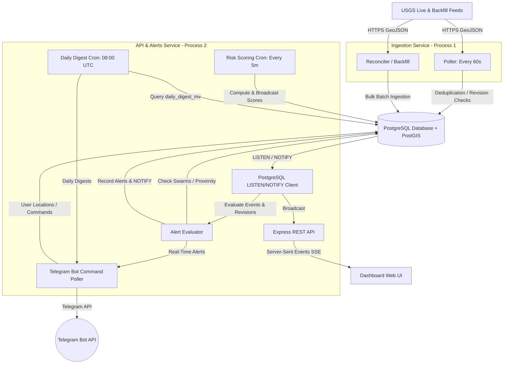

# System Architecture — QuakeDetector

## Executive Summary

QuakeDetector is a real-time seismic monitoring and alerting platform designed around three priorities:

1. Reliable continuous ingestion of external sensor-like event feeds.
2. Operationally useful risk monitoring and alerting.
3. Clear scaling visibility from a single-user deployment to multi-tenant production workloads.

The system continuously ingests live USGS earthquake feeds, performs spatial and temporal analysis using PostgreSQL + PostGIS, updates a live dashboard through Server-Sent Events (SSE), and delivers critical alerts through Telegram.

The current architecture intentionally favors low operational complexity and strong observability over premature distributed infrastructure.

The USGS earthquake feed is fundamentally a low-throughput data source. The `all_hour.geojson` feed is updated once per minute and typically contains only upto 3 new earthquake events per minute globally under normal seismic conditions, with occasional spikes during aftershock sequences or major regional events that too is not high volume according to the current setup, the 30 day historical feed is also relatively small and practical to process on a single machine without distributed ingestion infrastructure.

Because of this, the current system optimizes for:

* reliable ingestion with managing given throughput,
* idempotent updates,
* spatial querying,
* operational visibility,
* and alert correctness,

rather than maximizing raw throughput.

The document also outlines the exact bottlenecks and architectural transitions required to scale the platform from 1 user with 3 monitored locations to 10,000 users with 30,000 monitored locations with a scalable ingestion scenario which will be relevant to Kansha care and will be able to handle thousands of users with real time data.

---

# 1. High-Level Architecture

The platform is split into two independent services running against a shared PostgreSQL database with PostGIS extensions.

This separation isolates write-heavy ingestion workflows from read-heavy APIs, dashboard traffic, and alert delivery.



---

# 2. Core Architectural Decisions

## A. Why PostgreSQL + PostGIS

PostgreSQL was selected because the system requires transactional consistency, reliable upserts, scheduled aggregations, and spatial radius queries. PostGIS provides native geographic indexing and efficient distance calculations using `ST_DWithin`, which is central to proximity alerts, swarm detection, and location-based risk scoring.

* **High Performance**: Under high event density, PostGIS uses GiST spatial indexes to execute radius searches in $\sim 3\text{--}8\text{ ms}$, avoiding slow full table scans.
* **Low Complexity**: For the current assignment scale, PostgreSQL provides significantly lower operational complexity than introducing separate spatial databases or distributed event infrastructure.

---

## B. Separation of Ingestion and API Services

The system is divided into two services:

* **Ingestion Service**: Responsible for polling USGS feeds, reconciliation, deduplication, revision handling, and database writes.
* **API & Alerts Service**: Responsible for dashboard APIs, SSE connections, Telegram interactions, risk scoring, and scheduled digests.

This separation prevents user-facing load from interfering with ingestion reliability. If dashboard traffic spikes or heavy aggregation queries slow down API performance, ingestion continues independently and polling deadlines are not missed.

It also guarantees **resource isolation** (e.g. database connection pool exhaustion in Express won't impact 60s poller deadlines) and creates a clean future scaling path where API instances scale horizontally, while ingestion remains a single controlled writer running against read-replicas for Express REST routes.

---

## C. Why SSE Instead of WebSockets

The dashboard workload is primarily server-to-client updates. Clients mostly consume new earthquake events, health changes, and risk score updates.

SSE was selected because it:
* Works over standard HTTP without custom handshakes or routing proxies.
* Automatically handles reconnections and monitors channel state natively.
* Requires significantly less connection state management on the server, using only standard HTTP responses.
* Fits low-frequency streaming workloads well.

WebSockets would become more valuable only if the system evolved into a highly interactive multi-operator collaboration platform requiring bidirectional communication.

---

## D. Idempotent Ingestion & Revision Handling

USGS frequently revises events after publication. The ingestion pipeline therefore treats every event as mutable.

### Deduplication Strategy
* USGS event IDs (e.g., `us2025abc`) are mapped directly to the Primary Key of our `earthquakes` table.
* Every poll performs an upsert merge logic instead of blind insertion.
* Existing rows are updated when newer revisions arrive.

### Quality Conflict Resolution & Revisions
* If an event already exists, we compare the incoming `confidenceScore` against the database's record.
* If the incoming event has **higher or equal quality**, we overwrite the mutable fields (magnitude, alert level, tsunami status, etc.) and log changes in the `event_revisions` table.
* If the database's existing event has **higher quality**, we keep the database's record and only append the new USGS ID to our tracking arrays to reflect the merge.
* If safety-critical fields change (magnitude, alert status, tsunami warning), the alert evaluator re-runs rules for the event, ensuring no stale or lower-quality data survives permanently.

---

## E. Backfill & Reconciliation Flow

The first deployment performs a one-time historical backfill using the 30-day USGS feed. The ingestion worker:

1. Downloads the 30-day GeoJSON feed.
2. Queries IDs and update timestamps of local database events from the last 35 days to build an in-memory lookup map of existing IDs (`id -> updatedAt`).
3. Diffs incoming events against local records, avoiding thousands of raw database lookups.
4. Splits new events into batches of 5,000 and bulk-inserts them using `prisma.earthquake.createMany({ skipDuplicates: true })`.
5. Executes a fast bulk raw SQL update to populate the PostGIS geography coordinates:
   ```sql
   UPDATE earthquakes
   SET geog = ST_SetSRID(ST_MakePoint(longitude, latitude), 4326)::geography
   WHERE geog IS NULL;
   ```
6. Concurrently processes updated event revisions in batches of 50 using `Promise.allSettled`.

### Checkpoints
* **`BackfillLog`**: Acts as a persistent checkpoint indicating whether a full historical seed has completed.
* **`lastGenerated` (In-Memory)**: The poller tracks the feed's metadata generation time. If the feed's timestamp has not advanced, the poll is marked `stale` and early-exits, avoiding unnecessary database write transactions.

---

## F. Spatial Query Optimization

Two GiST indexes are created:

```sql
CREATE INDEX idx_eq_geog ON earthquakes USING GIST(geog);
CREATE INDEX idx_loc_geog ON user_locations USING GIST(geog);
```

These indexes accelerate:
* Radius searches.
* Swarm detection.
* Proximity evaluations.

Without GiST indexing, every radius check would require full table scans as the dataset grows. When evaluating if an event falls near a user's monitored locations, `ST_DWithin` utilizes the GiST index to quickly narrow down candidate points using bounding boxes rather than performing a full table scan.

---

# 3. Product & Operational Reasoning

Every data point and metric parsed by the system is mapped directly to emergency-response actions. We prioritize operational utility over raw scientific reporting:

* **Why Felt Reports Matter**: 
  A high-magnitude earthquake in a remote area might have zero immediate impact, whereas a moderate M4.5 earthquake in an urban center generates thousands of community felt reports within minutes. In EOC operations, felt reports act as an immediate proxy for public panic, structural disruption, and potential utility line damage.
* **Why the Tsunami Warning Flag is Critical**: 
  Tsunami propagation speeds leave coastal emergency operators with window periods of only 15 to 45 minutes to execute evacuations. Highlighting this flag prominently on the dashboard triggers emergency sirening and roadblock protocols.
* **Why We Focus on Significance (sig) Over Magnitude Alone**: 
  USGS uses a composite metric $0\text{--}1000$ (`sig`) combining magnitude, Mercalli intensity (MMI), felt reports, and regional vulnerability. We use it to filter out low-impact events so that emergency managers are not distracted by minor or deep ocean quakes.
* **Why Daily Digests Matter**: 
  Seismic sequences build up slowly. Providing a pre-computed 24-hour summary helps disaster directors report activity shifts to regional administrators without querying raw tables manually.
* **Why System Health Is Treated as Critical**: 
  A silent feed is operationally dangerous because dashboards appear healthy, but the system may no longer receive critical events. Because of this, source silence is treated as a first-class alert condition.

---

# 4. Risk Scoring Model

Each monitored location receives a continuously updated risk score from 0–100. The score combines three distinct math modules implemented in `risk.service.js` which run every 5 minutes:

### A. Score 1: Static Proximity Risk ($S_{static}$)
Represents the point-in-time threat of the strongest nearby seismic event:
$$S_{static} = \min\left(100, \frac{\text{MaxRaw}}{6}\right)$$

For each event in the location's radius, the raw score is calculated as:
$$\text{Raw} = \text{Base} \times \text{Proximity} \times \text{Recency} \times \text{DepthFactor} + \text{Bonuses}$$

Where:
* **Base (Non-linear magnitude scaling)**: $\text{Base} = \text{mag}^2 \times 10$ (M6.0 is 360, M4.0 is 160).
* **Proximity**: $\text{Proximity} = \frac{1}{\frac{d}{100} + 1}$ (halves every $100\text{ km}$).
* **Recency**: $\text{Recency} = e^{-\frac{t}{12}}$ (decays to $\sim 50\%$ in 12 hours).
* **Depth Factor**: $1.5$ for shallow ($<20\text{ km}$), $1.0$ for intermediate ($20\text{--}70\text{ km}$), $0.6$ for deep ($>70\text{ km}$).
* **Bonuses**: Tsunami warning ($+30$), orange/red PAGER alert ($+15$/$+25$), felt reports ($+10$/$+20$ if $>100$/$>500$).
* **Quality**: Multiplied by $1.1$ if reviewed; $0.8$ if stations $< 5$.

### B. Score 2: Delta Trend Risk ($S_{delta}$)
Detects emerging swarm activity and seismic compression:
$$S_{delta} = \min\left(100, T_{mag} + A_{freq} + C_{cohesion} + C_{compression}\right)$$

Where:
* **Magnitude Trend ($T_{mag}$)**: Linear regression slope of the last 10 event magnitudes $\times 20$.
* **Frequency Acceleration ($A_{freq}$)**: $\min\left(40, \ln\left(\frac{\text{Rate}_{3h}}{\text{Rate}_{24h}} + 1\right) \times 20\right)$.
* **Swarm Cohesion ($C_{cohesion}$)**: Compares the bounding radius of the last 5 events ($R_5$) to the last 20 events ($R_{20}$): $20 \times \frac{R_{20} - R_5}{R_{20}}$. A higher value means earthquakes are narrowing into a tight cluster.
* **Time Compression ($C_{compression}$)**: Measures the ratio of average time gaps between the last 10 vs last 5 events to detect rapid interval shrinking: $15 \times \left(\frac{\text{Gap}_{10}}{\text{Gap}_5} - 1\right)$.

### C. Score 3: Post-Event Aftershock Risk ($S_{post}$)
Evaluates the probability of secondary failures in the days following a mainshock (M4.0+):
$$S_{post} = \min\left(100, \text{AftershockRisk} \times \frac{100}{42.25} + (N_{aftershocks\_6h} \times 3) + \text{LargeAftershockBonus}\right)$$

Where:
* **Aftershock Risk**: $\text{mainshock.mag}^2 \times \text{decayFactor}$ (Omori-Utsu interpolation).
* **Båth's Law**: Expected aftershock magnitude: $M_{aftershock} = M_{mainshock} - 1.2$.
* **Large Aftershock Bonus**: $+20$ points if any aftershock magnitude exceeds $M_{mainshock} - 0.5$ in the last 6 hours.

### D. Final Displayed Risk
$$R_{displayed} = \min\left(100, \max\left(S_{static}, S_{delta} \times 0.8, S_{post} \times 0.9\right)\right)$$

### Example Factors

| Signal | Operational Meaning |
| :--- | :--- |
| High magnitude nearby | Potential infrastructure impact |
| Shallow depth | Stronger surface shaking |
| Increasing local frequency | Possible swarm escalation |
| Tsunami warning | Immediate evacuation relevance |
| Felt reports spike | Public disruption indicator |

---

# 5. Swarm Detection

A swarm is defined as $\ge 5$ earthquakes above magnitude $1.5$ within a $200 \text{ km}$ radius in a $30\text{-minute}$ window.

Each incoming live event above magnitude $1.5$ triggers a spatial-temporal query centered at the event's epicenter:

```sql
SELECT COUNT(*)::int AS "count", AVG(mag)::float AS "avgMag", MAX(mag)::float AS "maxMag"
FROM earthquakes
WHERE ST_DWithin(
    geog,
    ST_SetSRID(ST_MakePoint($1, $2), 4326)::geography,
    200000
)
AND event_time > NOW() - INTERVAL '30 minutes'
AND mag >= 1.5
AND id != $3;
```

Duplicate swarm alerts are prevented using a `dedupHash` based on:
* Location bucket (grid centroid coordinates).
* Time window.

We verify this hash against the `alerts_log` before pushing to Telegram, ensuring operators are not spam-notified during active clusters.

---

# 6. Dashboard Prioritization

The dashboard (`apps/web`) is specifically customized for Emergency Operations Center (EOC) operators, prioritizing actionable risk signals and adhering to established UX laws to minimize cognitive friction:

## Priority Order
1. Active critical alerts (Tsunami, high severity)
2. Ingestion feed health status
3. Local monitored risk scores
4. High-severity earthquakes list
5. Historical activity logs

---

## Global View
The world dashboard includes a live earthquake map, recent event stream, severity color coding, and ingestion health indicators. Critical events are highlighted immediately using high-contrast visual markers.
* **Visual Hierarchy (Aesthetic-Usability Effect)**: We use a dark operational theme with bright neon highlights. Earthquakes are color-coded instantly by severity: Red (Critical, $M \ge 5.0$), Orange (Warning, $M \ge 4.0$), Yellow (Caution, $M \ge 3.0$), and Green/Blue (Info).
* **Gestalt Law of Proximity**: Key operational telemetry (Total events, high-severity counts, tsunami alarms, source connection health) is grouped in a horizontal KPI card strip at the very top of the viewport. This gives operators immediate status visibility without requiring scrolling.

---

## Location Monitoring View
Each monitored location displays nearby activity, largest recent event, active alert thresholds, and current risk score.
* **Hick’s Law**: The dashboard intentionally limits monitored locations to **exactly 3** slots to prevent decision paralysis. Operators choose the 3 highest-priority regional centers and focus resources without scanning endless lines of noise.

---

## Information Density Controls
* **Miller’s Law**: Large event lists are paginated to 50 items at a time and incrementally rendered using a "Load More" pagination pattern. This prevents excessive frontend rendering lag, visual overload, and degraded dashboard responsiveness.

---

# 7. Internal Observability

The system continuously monitors its own ingestion and delivery pipeline to maintain trust during crisis scenarios:

## Poll Health Metrics (`poll_health`)
The table tracks poller operations to identify ingestion issues early:
* `status`: Poll success or failure.
* `response_ms`: Network latency to USGS servers.
* `events_fetched` & `new_events`: Processing rates.
* `error_message`: Retains error traces for quick debugging.

---

## Alert Delivery Audits (`alerts_log`)
Every outgoing Telegram notification is recorded in `alerts_log`:
* `sent`: Set to `false` when network or Telegram API failures occur.
* `dedup_hash`: Unique hash (`event_id:chat_id`) to ensure no duplicate notifications are sent.
Failed deliveries remain retryable via a 5-minute sweeps cron until confirmed, preventing temporary API outages from silently dropping critical alerts.

---

## Dashboard Health Banner
An indicator card on the frontend queries `/api/health` and highlights any recent failure logs or long polling delays in red, warning operators if the ingestion channel is lagging.

---

# 8. Burst Handling & Failure Modes

## A. Burst Traffic Handling
Normal ingestion volume is roughly 60 earthquakes/hour, but large seismic sequences can exceed 300/hour (e.g. an active aftershock sequence). The current system handles this burst load through:
* **Short Database Transactions**: The poller processes each event in isolation. Inserting or updating a single earthquake takes only $\sim 15 \text{ ms}$, ensuring the poller completes its cycles far ahead of the 1-minute window.
* **GiST-Accelerated Spatial Queries**: When checking for swarms or local proximity, PostGIS uses the **GiST index** on `earthquakes.geog` and `user_locations.geog`. This avoids table scans, executing radius searches in $\sim 3\text{--}8 \text{ ms}$ even during high event density.
* **Lightweight Notifications**: Real-time notifications utilize PostgreSQL's `LISTEN/NOTIFY`. The payload sent through the notify channel is just the event ID, keeping DB buffer usage minimal.

---

## B. Failure Handling

| Failure Scenario | How the Current System Handles It (Redundancy & Safety) |
| :--- | :--- |
| **USGS Feed Unreachable** | The Ingestion poller intercepts the network error, records a failing health status in `poll_health`, and schedules the next poll using **exponential backoff** (doubling the interval up to a 10-minute cap). If the feed remains unreachable for $>10 \text{ minutes}$, a `source_silence` alert is automatically broadcast to all Telegram chats. |
| **USGS Returns Stale Data** | The poller compares the `generated` timestamp in the feed metadata against the local `lastGenerated` checkpoint. If the feed is stale, it skips DB processing and exits early to avoid unnecessary write transactions. |
| **USGS Revises Event Data** | Revisions are detected by comparing the updated features against the database. If a safety-critical field (e.g. magnitude, alert status, tsunami warning) changes, the new values are written, a change log is appended to `event_revisions`, and the alert evaluator re-evaluates rules for the event. |
| **PostgreSQL Database Outage** | The API service maintains an **in-memory location cache** that refreshes from the DB every 60 seconds. If Postgres becomes unreachable, the alert evaluator falls back to calculating proximity using an **in-memory Haversine formula loop** against this cached location data, ensuring safety evaluations are not completely lost. |
| **Telegram API Rate Limits & Network Drops** | The API writes alert payloads to the `alerts_log` table with `sent = false`. A cron-driven sweep runs every 5 minutes to find unsent messages and retries delivery to Telegram, ensuring no alerts are permanently dropped due to network issues or rate limiting. |
| **Dashboard SSE Socket Disconnection** | The React dashboard detects connection drops and automatically attempts to reconnect. The SSE endpoint serves the current system status and latest events on connection startup, reconciling any missed real-time events. |

---

# 9. Scaling Breakdown

The current architecture intentionally favors simplicity at small scale. This section outlines the specific bottlenecks, hard numbers, and thresholds where the current system fails:

## Phase 1 — 100 Users / 300 Locations (Stable)
At this scale, the system remains healthy:
* **SSE Memory**: 100 concurrent SSE connections $\times$ 50 KB each $\approx$ 5 MB of RAM.
* **Proximity Checks**: A single GiST radius query against 300 points executes in $\sim 3\text{ ms}$.
* **Daily Digest Cron**: Dispatching 100 Telegram messages takes $\sim 3.3 \text{ seconds}$ (under Telegram’s 30 msg/sec rate limit).

---

## Phase 2 — 1,000 Users / 3,000 Locations (First Bottlenecks)
* **Daily Digest Blocking**: Querying 30 days of data and performing per-location summaries for 3,000 locations takes $\sim 60 \text{ seconds}$ of database CPU time. Because the cron runs inside the main Express process, it blocks the single-threaded Node.js event loop, delaying dashboard SSE heartbeats and event polling cycles.
* **Swarm DB Load**: During an aftershock sequence ($\sim 300$ events/hour), the listener performs 16 queries per event (finding locations within 200km + count query for each). This translates to 4,800 queries/hour, consuming $\sim 1\text{ second}$ of DB time every minute just on swarm checks.
* **Required Improvements**: Dedicated worker processes, read replicas, and job queues for digest generation.

---

## Phase 3 — 5,000 Users / 15,000 Locations (Active Failures Begin)
* **SSE Memory & Socket Limits**: Assuming a realistic 40% active connection rate, 2,000 users are concurrently connected. At 90 KB per active connection (socket buffers, response object, and metadata), this consumes **180 MB** of server RAM. More critically, 2,000 connections exceed the default Linux **ulimit file descriptor limit (1,024)**, leading the server to immediately refuse new client connections.
* **The Horizontal Scaling Wall**: To relieve memory pressure, a second server instance (Server B) is added. When an alert fires, Server B receives the database `NOTIFY` and evaluates it, but it cannot notify users whose SSE sockets are active on Server A. Alerts are silently dropped.
* **Postgres Connection Exhaustion**: Default `max_connections = 100` gets saturated as multiple server instances, polling loops, listeners, and cron processes compete for connections.
* **Swarm DB Blocking**: A California epicentral event matches 80 locations. Evaluating swarms requires 80 count queries $\times$ 12 ms $\approx$ 960 ms of DB CPU time per event, blocking other dashboard queries.
* **Required Improvements**: Redis pub/sub or Kafka for distributed events, connection pooling (PgBouncer), distributed event workers, and a dedicated notification pipeline.

---

## Phase 4 — 10,000 Users / 30,000 Locations (System Collapse)
* **Alert Latency Cascade**: An event matches 200 locations. Querying user associations and updating tables sequentially takes $\ge 2 \text{ seconds}$ per event. If 3 events arrive in the same minute during a swarm, alert latency grows exponentially.
* **Cron Thread Starvation**: Compiling and sending 10,000 Telegram messages takes $10,000 / 30 \text{ msg/sec} \approx 333 \text{ seconds}$ ($\sim 5.5 \text{ minutes}$). The server process is locked in a tight delivery loop, dropping SSE heartbeats and failing to poll new events.
* **Postgres NOTIFY Limitations**: Postgres `NOTIFY` is not a persistent queue. The notification channel has an **8 KB payload limit** (which gets truncated with enriched payloads) and lacks delivery guarantees—if a listener is temporarily disconnected, the events are permanently lost.
* **Required Architectural Changes**: Kafka or RabbitMQ for durable event streaming, distributed worker queues, geospatial partitioning, Redis-backed WebSocket/session infrastructure, and dedicated alert fanout services.

---

# 10. What We Deliberately Did Not Build (And Why)

1. **Kafka / RabbitMQ**:
   * *Why*: The current scale does not justify distributed broker infrastructure. PostgreSQL `LISTEN/NOTIFY` keeps operational overhead low while still supporting lightweight real-time signaling.
2. **Complex In-Memory Spatial Structures**:
   * *Why*: The current product scope limits users to exactly 3 monitored locations. A simple in-memory Haversine loop is sufficient, takes $<0.1\text{ ms}$ for 3 locations, and keeps degraded-mode logic easy to maintain.
3. **Real-Time Digest Aggregation**:
   * *Why*: Daily summaries are generated from a materialized view refreshed before digest execution. This isolates heavy aggregation work from live ingestion traffic.

---

# 13. Requirement Coverage

| Assignment Requirement | Technical Implementation | Relevant Source Files |
| :--- | :--- | :--- |
| **Historical backfill** | 30-day reconciliation GeoJSON diff and bulk Prisma seeding. | [backfill.js](file:///c:/Users/akash/Desktop/practise/quake-detector/apps/ingestion/src/backfill.js) |
| **Live polling** | 60-second ingestion poller with duplicate merging. | [earthquake.service.js](file:///c:/Users/akash/Desktop/practise/quake-detector/apps/api/src/services/earthquake.service.js) |
| **Deduplication** | ID-based upsert merge logic and quality checks. | [earthquake.service.js](file:///c:/Users/akash/Desktop/practise/quake-detector/apps/api/src/services/earthquake.service.js) |
| **Event revisions** | Mutable field reconciliation and audit logging. | [earthquake.service.js](file:///c:/Users/akash/Desktop/practise/quake-detector/apps/api/src/services/earthquake.service.js) |
| **Global dashboard** | SSE-driven live monitoring UI with KPI panels. | [WorldViewPage.jsx](file:///c:/Users/akash/Desktop/practise/quake-detector/apps/web/src/pages/WorldViewPage.jsx) |
| **Location dashboard** | Spatial proximity, risk scoring, and map views. | [LocationsPage.jsx](file:///c:/Users/akash/Desktop/practise/quake-detector/apps/web/src/pages/LocationsPage.jsx) |
| **Swarm alerts** | Spatial-temporal PostGIS queries and dedup hashing. | [swarm.service.js](file:///c:/Users/akash/Desktop/practise/quake-detector/apps/api/src/services/swarm.service.js) |
| **Source silence alerts**| Poll health monitoring and Telegram status triggers. | [health.service.js](file:///c:/Users/akash/Desktop/practise/quake-detector/apps/api/src/services/health.service.js) |
| **Daily summaries** | Materialized-view daily digest cron pipeline. | [digest.service.js](file:///c:/Users/akash/Desktop/practise/quake-detector/apps/api/src/services/digest.service.js) |
| **Telegram integration**| Multi-user bot alert and location registration system. | [telegram.service.js](file:///c:/Users/akash/Desktop/practise/quake-detector/apps/api/src/services/telegram.service.js) |
| **System health visibility**| Ingestion health monitoring card on the dashboard. | [SystemHealthPage.jsx](file:///c:/Users/akash/Desktop/practise/quake-detector/apps/web/src/pages/SystemHealthPage.jsx) |

---

# 14. Final Notes On Current Setup

The current implementation intentionally optimizes for reliability, operational visibility, low infrastructure complexity, and clear scaling boundaries. Rather than prematurely introducing distributed infrastructure, the system focuses on building a reliable operational core first while explicitly documenting where architectural transitions become necessary as scale increases.

# 15. Future Architecture (V1 Scaling): 10,000 Users & 30,000 Locations

This section outlines the architectural transition required to safely handle IoT-scale ingestion and massive concurrent user demand.

## A. Target Metrics

* **Availability:** Alert delivery $\ge$ 99.9% (8.7 hours downtime/year max). Dashboard $\ge$ 99.5%. Ingestion pipeline $\ge$ 99.95%.
* **Latency:** Real-time alert end-to-end $\le$ 2 seconds from event ingest to user notification. Dashboard API P99 $\le$ 200ms. SSE event delivery $\le$ 500ms after alert fires.
* **Throughput:** Peak IoT-equivalent 2,000 events/minute (simulating a dense sensor network). Alert fan-out to 10,000 users within 3 seconds of trigger.

## B. Capacity Estimates

* **Users and locations:** 10,000 users, 30,000 locations, average 3 locations/user. Assume 40% concurrent = 4,000 active SSE connections at peak.
* **Event volume (IoT scale):** 2,000 events/minute = 33 events/second. Each enriched event payload 4KB. That's 132KB/second ingestion throughput. Per day: 2.88M events $\times$ 4KB = 11.5GB raw data/day.
* **Alert fan-out:** A significant earthquake can match 200 of 30,000 locations. 200 locations $\times$ average 1.3 users/location = 260 users to notify per event. At 33 events/second peak, worst case 33 $\times$ 260 = 8,580 SSE pushes/second.
* **Swarm detection:** Per event, check if geohash cell has $>5$ events in 30 minutes. Pure Redis operation, target $\le$ 2ms per check.
* **Storage:** Hot (Postgres): last 7 days = 7 $\times$ 2.88M = $\sim$20M rows, at $\sim$500 bytes/row = 10GB. Cold (object store, Parquet): 30 days = $\sim$120GB, compresses to $\sim$30GB at 4:1 Parquet compression.
* **Daily digest:** 10,000 Telegram messages at Telegram's 30 msg/sec limit = 333 seconds = 5.5 minutes of send time. Aggregation query over 30-day cold store, not Postgres.

## C. Revised Architecture Diagram

[System Architecture Diagram - Figma](https://www.figma.com/board/vY9wG4BaiqnjfVkn1H1Ox9/Realtime-IOT-Platform-Architecture-v1?node-id=0-1&t=JROjPpqjUoZovvUQ-1)

## D. Core Scaling Upgrades

### 1. Ingestion Layer
**Edge polling service** — single responsibility: poll USGS every 60 seconds, deduplicate by event ID + updated timestamp, publish to `events.raw`. Stateless, one instance is enough (USGS is a single source). Failure handling: exponential backoff on HTTP errors, publishes to `health.ingestion` on every poll attempt (success or failure). If silent for 10 minutes, a Kafka consumer on the health topic fires the feed-silence alert.

**Why Kafka here**: The processor and alert engine are independent consumers. If the alert engine is slow or restarting, it reads from its own offset without blocking ingestion. You get replay for free. **Kafka runs as 3 brokers** (replication factor 3, min ISR 2). You can lose one broker with zero data loss. At 8MB/minute throughput, this is lightly loaded. 

### 2. Processor Service (2 instances, same consumer group)
Consumes `events.raw`. For each event: validate schema, compute which of 30,000 locations are within 500km using a single PostGIS query, classify severity, then writes to three sinks:
* **Postgres upsert (hot store)**: current event state, indexed for dashboard reads.
* **Object store (cold)**: Parquet files partitioned by `year/month/day`. Written in micro-batches every 5 minutes.
* **Redis sorted sets (swarm state)**: geohash bucketed.

It publishes the enriched event to `events.enriched` for the alert engine. Partition assignment is automatic via the Kafka consumer group protocol.

### 3. Hot Store — PostgreSQL with PgBouncer
PostGIS provides native geographic operators that run against GiST indexes. A 30,000-row locations table with a GiST index answers "which locations are within 500km" in $\sim$15ms. 
**PgBouncer** is placed in transaction pooling mode in front of Postgres to multiplex $\sim$70 application-level connections through a pool of 20 actual Postgres connections, saving 250MB+ of connection state memory. A **Read replica** handles dashboard read queries (recent events, location stats, risk score data) to separate OLAP-style dashboard reads from OLTP event writes.

### 4. Cold Store — Object Store with Parquet
Historical queries (30-day views, daily digest) run against Parquet files via an embedded query engine (DuckDB). At 30GB of cold data, DuckDB running in-process answers a "top 3 active regions last 30 days" query in 2–4 seconds without a cluster. Parquet provides a 4:1 compression ratio and columnar access, making queries 10–15$\times$ faster than raw JSON.

### 5. Swarm Detection — Redis Sorted Sets with Geohash
Instead of querying Postgres per event, we maintain an in-memory spatial-temporal index in Redis.
* **Structure**: One sorted set per geohash cell at precision 4. Key: `swarm:{geohash}`, value: event ID, score: Unix timestamp in ms.
* **Operations**: On each event, compute geohash, `ZADD` the event, `ZREMRANGEBYSCORE` to evict entries older than 30 minutes, and `ZCARD` to get the current count. 

All operations run in a single atomic Lua script. Total Redis latency is $\sim$2ms per event compared to 1.8 seconds in Postgres.

### 6. Alert Engine (2 instances)
Consumes `events.enriched`. Runs swarm check (Redis), magnitude threshold check, and per-location proximity check (no DB queries needed since the enriched event already has matched location IDs). If any rule fires, it publishes to `alerts.triggered` and a Redis pub/sub channel `alerts:{user_id}` for SSE delivery.

### 7. SSE Delivery Pipeline
The communication pattern is strictly server-to-client: alerts fire, server pushes to user. WebSockets are avoided as bidirectional communication is unnecessary.
**SSE delivery path**: The Alert engine publishes to the Redis pub/sub channel `alerts:{user_id}`. Each SSE server instance is subscribed to the channels for all user IDs whose connections it holds. 3 SSE server nodes handle up to 1,500 concurrent connections each ($\sim$135MB memory footprint per instance).

### 8. API Layer & Redis Caching
3 stateless API server instances behind an L7 load balancer handle dashboard data reads and location management.
* **Response cache**: Dashboard API responses cached with 30-second TTL.
* **Location lookup cache**: The 30,000 user locations cached in Redis as a hash.
* **Risk score cache**: Computed risk scores cached per location with a 5-minute TTL.

### 9. Telegram Service (Dedicated Webhook & Rate Limiter)
A separate, isolated service consumes the `alerts.triggered` Kafka topic and the daily digest trigger. 

* **Webhook-Based Command Handling**: Instead of the V1 long-polling approach (which does not scale horizontally), the service registers a webhook with Telegram. User commands and location registrations are pushed directly to a dedicated load-balanced endpoint.
* **Rate Limit Handling & Queueing**: To strictly adhere to Telegram's 30 msg/sec limit and prevent API bans during massive alert fan-outs (or the 5.5-minute daily digest dispatch), the service uses an internal token-bucket rate limiter backed by Redis. Messages exceeding the rate limit are held in queue and delivered smoothly over time without failing or starving other system processes.

### 10. Hardware Summary

| Component | Nodes | Spec per node |
|---|---|---|
| L4 / L7 Load Balancers | 6 total | 2 vCPU, 2-4GB |
| API / SSE Servers | 6 total | 4 vCPU, 8GB |
| Kafka Brokers | 3 | 4 vCPU, 16GB, 500GB NVMe |
| Processor / Alert Engine | 4 total | 4 vCPU, 8GB |
| Telegram Service | 1 | 2 vCPU, 2GB |
| Redis (Pub/Sub + Cache) | 3 | 4 vCPU, 16GB |
| Postgres (Primary + Replica) | 2 | 8 vCPU, 32GB, 500GB SSD |
| PgBouncer | 2 | 2 vCPU, 2GB |
